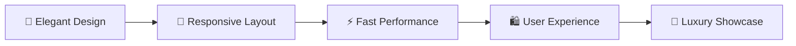

# 💎 Kohinoor Jewels - Discover Timeless Beauty

<div align="center">


</div>

<div align="center">

[](https://developer.mozilla.org/en-US/docs/Web/HTML)
[](https://developer.mozilla.org/en-US/docs/Web/CSS)
[](https://developer.mozilla.org/en-US/docs/Web/JavaScript)
[](https://pages.github.com/)

[](https://araj59197.github.io/KodnestFrontend/)
[](https://github.com/araj59197/KodnestFrontend/stargazers)
[](https://github.com/araj59197/KodnestFrontend/network/members)

</div>

<div align="center">
  
  ### 🌟 A luxury jewelry website showcasing handcrafted masterpieces 🌟
  
  
  
</div>

---


## 📖 Table of Contents

- [✨ About](#-about)
- [🚀 Features](#-features)  
- [🛠️ Tech Stack](#️-tech-stack)
- [📂 Project Structure](#-project-structure)
- [🎨 Design Highlights](#-design-highlights)
- [📱 Pages Overview](#-pages-overview)
- [⚡ Quick Start](#-quick-start)
- [🌐 Deployment](#-deployment)
- [📸 Screenshots](#-screenshots)
- [👨‍💻 Author](#-author)
- [🤝 Contributing](#-contributing)
- [📄 License](#-license)

<br clear="right"/>

---

<div align="center">
  
</div>

## ✨ About


**Kohinoor Jewels** is a premium jewelry website that celebrates the art of traditional Indian craftsmanship with modern design aesthetics. Founded in 1985, this platform showcases exquisite handcrafted jewelry pieces including gold necklaces, diamond earrings, and emerald rings.

<br clear="left"/>

### 🎯 Project Goals



- **🎨 Create** an elegant, user-friendly jewelry e-commerce experience
- **📱 Showcase** premium jewelry collections with stunning visuals  
- **⚡ Implement** responsive design for all devices
- **💻 Demonstrate** modern web development practices

---

<div align="center">
  
  
  
</div>

## 🚀 Features

<div align="center">
  
</div>

### 🛍️ **Frontend Features**

<details>
<summary>🎨 <b>UI/UX Design</b></summary>

- ✨ **Modern & Elegant Interface**
- 🎨 **Luxury Gold & Brown Color Scheme**  
- 📱 **Fully Responsive Design**
- 🔄 **Smooth CSS Animations**
- 💫 **Interactive Hover Effects**

</details>

<details>
<summary>📱 <b>Navigation & Layout</b></summary>

- 🧭 **Intuitive Navigation Menu**
- 🏠 **Clean Homepage Layout**  
- 📋 **Product Grid Display**
- 📄 **Multi-page Architecture**
- 🔗 **Cross-page Linking**

</details>

<details>
<summary>💎 <b>Product Showcase</b></summary>

- 🖼️ **High-Quality Product Images**
- 💰 **Price Display with Discounts**
- ⭐ **Product Ratings & Reviews**
- 🏷️ **Product Categories & Badges**
- 📝 **Detailed Product Descriptions**

</details>

<details>
<summary>📞 <b>Contact & Communication</b></summary>

- 📧 **Functional Contact Form**
- 📍 **Company Information Display**
- 🗺️ **Location & Contact Details**
- 💬 **Mailto Integration**
- 📱 **Multiple Contact Options**

</details>

---

<div align="center">
  
</div>

## 🛠️ Tech Stack

<div align="center">

| Frontend | Styling | Tools | Hosting |
|----------|---------|-------|---------|
|  |  |  |  |
|  |  |  |  |

</div>

### 🎨 **Design Features**
- **🎯 Responsive Design** - Works on all device sizes
- **⚡ CSS Grid & Flexbox** - Modern layout techniques  
- **🎨 CSS Variables** - Consistent color scheme
- **💫 Animations** - Smooth transitions and effects
- **📱 Mobile-First** - Optimized for mobile devices

### 🌐 **Web Standards**
- **🔍 SEO Optimized** - Meta tags and semantic HTML
- **♿ Accessible** - ARIA labels and semantic structure
- **⚡ Performance** - Optimized images and code
- **🔒 Secure** - HTTPS deployment
- **Wishlist System** - Save favorite items for later
- **Product Filters** - Sort by category, price, and style

### 🎨 **User Experience**
- **Responsive Design** - Perfect on desktop, tablet, and mobile
- **Smooth Animations** - Elegant hover effects and transitions
- **Interactive Elements** - Dynamic buttons and notifications
- **Fast Loading** - Optimized images and efficient code
- **Accessibility** - ARIA labels and semantic HTML

### 🏆 **Modern Design**
- **Luxury Color Palette** - Gold, cream, and brown theme
- **Typography** - Premium Google Fonts (Playfair Display, Inter)
- **Visual Hierarchy** - Clear layout and content organization
- **Custom Icons** - SVG icons and emojis for visual appeal

---

## 🛠️ Technologies Used

### **Frontend**
-  **HTML5** - Semantic markup and structure
-  **CSS3** - Advanced styling with Flexbox/Grid
-  **Vanilla JavaScript** - Interactive functionality

### **Design & Assets**
- **Google Fonts** - Playfair Display, Inter, Dancing Script
- **Unsplash Images** - High-quality stock photography
- **Custom SVG Icons** - Scalable vector graphics
- **CSS Variables** - Consistent theming system

### **Deployment**
-  **GitHub** - Version control and repository
-  **GitHub Pages** - Free static site hosting

---

<div align="center">
  
  
  
</div>

## 📂 Project Structure

<div align="center">
  
</div>

```
📁 KodnestFrontend/
├── 🏠 index.html                    # Main landing page
├── 📁 CSS/
│   └── 🎨 styles.css               # Main stylesheet (2250+ lines)
├── 📁 Html/
│   ├── � about.html               # Company history & team
│   ├── 🛍️ collections.html         # Product catalog  
│   ├── 📞 contact.html             # Contact information
│   ├── 🏠 Pratice_task.html        # Alternative home page
│   └── 📁 Images/
│       ├── 🥇 gold-necklace.jpg
│       ├── 💎 diamond-earrings.jpg
│       └── 💚 emerald-ring.jpg
├── 📖 README.md                    # Project documentation
└── 🔧 .git/                       # Git version control
```

---

<div align="center">
  
</div>

## 🎨 Design Highlights


### **🎨 Color Palette**

<div align="center">

| Color | Hex Code | Usage |
|-------|----------|-------|
| 🏆 Primary Gold | `#D4AF37` | Headers, Buttons |
| 🥉 Secondary Gold | `#B8860B` | Accents, Borders |
| ✨ Accent Gold | `#FFD700` | Highlights, Icons |
| 🤎 Dark Brown | `#2C1810` | Text, Navigation |
| 🧴 Cream | `#FFF8DC` | Backgrounds |
| ⚪ Off-White | `#FEFDF8` | Cards, Sections |

</div>

### **📝 Typography Scale**
- **🎭 Headings:** Playfair Display (Elegant serif)
- **📄 Body Text:** Inter (Modern sans-serif)  
- **✨ Decorative:** Dancing Script (Stylish cursive)

### **🎯 Key Design Elements**
- 🌈 **Gradient Overlays** - Sophisticated background effects
- 📋 **Card-based Layout** - Clean, organized content blocks
- 🎭 **Hover Animations** - Smooth micro-interactions
- 📐 **Golden Ratio** - Proportional spacing and sizing

<br clear="right"/>

---

<div align="center">
  
</div>

## 📱 Pages Overview

<table align="center">
<tr>
<td align="center" width="25%">

### 🏠 **Home Page**
`index.html`

🎯 Hero Section<br>
🏷️ Featured Categories<br>
⭐ Product Showcase<br>
🎁 Promotional Banner<br>
📝 About Preview

</td>
<td align="center" width="25%">

### 📖 **About Page**  
`about.html`

📜 Company History<br>
💎 Core Values<br>
👥 Team Members<br>
🏆 Awards & Recognition<br>
🎨 Craftsmanship

</td>
<td align="center" width="25%">

### 🛍️ **Collections**
`collections.html`

📋 Product Grid<br>
🔍 Category Filters<br>
🃏 Product Cards<br>
💖 Interactive Features<br>
🛒 Shopping Experience

</td>
<td align="center" width="25%">

### 📞 **Contact Page**
`contact.html`

📝 Contact Form<br>
🏪 Store Information<br>
📱 Social Media<br>
🗺️ Map Integration<br>
📧 Multiple Contact Options

</td>
</tr>
</table>

---

<div align="center">
  
</div>

## ⚡ Quick Start


### **Prerequisites**
- 🌐 Modern web browser (Chrome, Firefox, Safari, Edge)
- 📝 Text editor (VS Code, Sublime Text, Atom)  
- 🔧 Git (for version control)

<br clear="left"/>

### **🚀 Local Development**

```bash
# 1️⃣ Clone the Repository
git clone https://github.com/araj59197/KodnestFrontend.git
cd KodnestFrontend

# 2️⃣ Open in Browser
# Simply open index.html in your browser
# Or use Live Server extension in VS Code

# 3️⃣ Start Developing!
# Main entry point: index.html
# Styles: CSS/styles.css  
# Pages: Html/ directory
# Images: Html/Images/ directory
```

### **💡 Development Tips**
- ✨ Use VS Code with Live Server for real-time preview
- 🔍 Browser DevTools for debugging and testing
- 📱 Responsive design testing on different screen sizes
- 🎨 Modify CSS variables for quick theme changes

---

<div align="center">
  
</div>

## 🌐 Deployment

<div align="center">

### **🚀 GitHub Pages Deployment**

[](https://pages.github.com/)

</div>

This project is **automatically deployed** using GitHub Pages:

### **⚙️ Setup Process**
1. **📋 Repository Settings**
   - Go to repository `Settings` → `Pages`
   - Source: Deploy from branch `main`
   - Folder: `/ (root)`

2. **🔄 Automatic Deployment**
   - Every push to `main` branch triggers rebuild
   - Website updates within 2-3 minutes
   - Custom domain support available

3. **🔗 Live URL**
   ```
   🌐 https://araj59197.github.io/KodnestFrontend/
   ```

### **🔄 Alternative Deployment Options**

<div align="center">

[](https://netlify.com)
[](https://vercel.com)
[](https://firebase.google.com)

</div>

---

<div align="center">
  
</div>

## 📸 Screenshots

<div align="center">

### 🏠 **Home Page**
*Elegant landing page with hero section and featured products*


---

### 📖 **About Page**  
*Company story and team showcase*


---

### 🛍️ **Collections Page**
*Product catalog with interactive features*


---

### 📞 **Contact Page**
*Contact form and business information*


</div>

### 🛍️ Collections
*Comprehensive product catalog with filtering options*

### 📖 About Us
*Company story and team member profiles*

### 📞 Contact
*Professional contact form and business information*

---

## 🔮 Future Enhancements

### **Phase 1: Enhanced Functionality**
- [ ] **User Authentication** - Login/Register system
- [ ] **Payment Integration** - Stripe/PayPal checkout
- [ ] **Admin Dashboard** - Product management
- [ ] **Customer Reviews** - Rating and review system

### **Phase 2: Advanced Features**
- [ ] **AI Recommendations** - Personalized suggestions
- [ ] **Virtual Try-On** - AR jewelry preview
- [ ] **Multi-language** - International support
- [ ] **Mobile App** - React Native companion

### **Phase 3: Business Features**
- [ ] **Inventory Management** - Stock tracking
- [ ] **Analytics Dashboard** - Sales insights
- [ ] **CRM Integration** - Customer management
- [ ] **Email Marketing** - Automated campaigns

---

## 🤝 Contributing

We welcome contributions to make Kohinoor Jewels even better!

### **How to Contribute**

1. **Fork the Repository**
   ```bash
   git fork https://github.com/araj59197/KodnestFrontend.git
   ```

2. **Create Feature Branch**
   ```bash
   git checkout -b feature/amazing-feature
   ```

3. **Commit Changes**
   ```bash
   git commit -m "Add amazing feature"
   ```

4. **Push to Branch**
   ```bash
   git push origin feature/amazing-feature
   ```

5. **Open Pull Request**
   - Describe your changes
   - Include screenshots if applicable
   - Reference any related issues

### **Contribution Guidelines**
- 🧹 Keep code clean and well-commented
- 📱 Ensure responsive design compatibility
- 🧪 Test on multiple browsers
- 📖 Update documentation as needed

---

<div align="center">
  
</div>

## 👨‍💻 Author

<div align="center">


### **Aditya Raj**
*Full Stack Developer & UI/UX Designer*

[](https://github.com/araj59197)
[](https://linkedin.com/in/araj59197)
[](https://araj59197.github.io)

**🎯 Specializing in:** Frontend Development • UI/UX Design • Responsive Web Design

</div>

### **🏆 Achievements**
- 💻 **Frontend Specialist** - Expert in HTML, CSS, JavaScript
- 🎨 **Design Enthusiast** - Creating beautiful, user-friendly interfaces
- 📱 **Responsive Design** - Mobile-first development approach
- ⚡ **Performance Optimization** - Fast, efficient web solutions

---

<div align="center">
  
  
  
</div>

## 🤝 Contributing


We welcome contributions from the community! Here's how you can help make Kohinoor Jewels even better:

### **� How to Contribute**

1. **🍴 Fork the Repository**
   ```bash
   # Click the Fork button on GitHub
   ```

2. **🌿 Create Feature Branch**
   ```bash
   git checkout -b feature/amazing-feature
   ```

3. **✨ Make Your Changes**
   ```bash
   # Add your improvements
   git add .
   git commit -m "Add amazing feature"
   ```

4. **📤 Push to Branch**
   ```bash
   git push origin feature/amazing-feature
   ```

5. **� Open Pull Request**
   ```bash
   # Create PR on GitHub
   ```

<br clear="right"/>

### **💡 Contribution Ideas**

<div align="center">

| 🎨 Design | 🚀 Features | 🐛 Fixes | 📝 Docs |
|-----------|-------------|----------|---------|
| UI Improvements | New Pages | Bug Reports | Code Comments |
| Animations | Interactive Elements | Performance Issues | Tutorial Updates |
| Responsive Design | Accessibility | Cross-browser Fixes | API Documentation |
| Color Schemes | User Experience | Code Optimization | Usage Examples |

</div>

### **📋 Contribution Guidelines**
- ✅ **Follow** existing code style and conventions
- 📝 **Document** your changes thoroughly
- 🧪 **Test** across different browsers and devices
- 🎯 **Focus** on user experience improvements
- 💬 **Communicate** clearly in pull requests

---

<div align="center">
  
</div>

## 📄 License

<div align="center">

[](https://opensource.org/licenses/MIT)

</div>

This project is licensed under the **MIT License** - see the [LICENSE](LICENSE) file for details.

<details>
<summary><b>📜 View License Details</b></summary>

```
MIT License

Copyright (c) 2025 Aditya Raj

Permission is hereby granted, free of charge, to any person obtaining a copy
of this software and associated documentation files (the "Software"), to deal
in the Software without restriction, including without limitation the rights
to use, copy, modify, merge, publish, distribute, sublicense, and/or sell
copies of the Software, and to permit persons to whom the Software is
furnished to do so, subject to the following conditions:

The above copyright notice and this permission notice shall be included in all
copies or substantial portions of the Software.

THE SOFTWARE IS PROVIDED "AS IS", WITHOUT WARRANTY OF ANY KIND, EXPRESS OR
IMPLIED, INCLUDING BUT NOT LIMITED TO THE WARRANTIES OF MERCHANTABILITY,
FITNESS FOR A PARTICULAR PURPOSE AND NONINFRINGEMENT. IN NO EVENT SHALL THE
AUTHORS OR COPYRIGHT HOLDERS BE LIABLE FOR ANY CLAIM, DAMAGES OR OTHER
LIABILITY, WHETHER IN AN ACTION OF CONTRACT, TORT OR OTHERWISE, ARISING FROM,
OUT OF OR IN CONNECTION WITH THE SOFTWARE OR THE USE OR OTHER DEALINGS IN THE
SOFTWARE.
```

</details>

---

<div align="center">
  
</div>

## 📞 Support & Contact

<div align="center">

### **🆘 Need Help?**


</div>

<table align="center">
<tr>
<td align="center" width="33%">

### 🐛 **Bug Reports**
Found a bug? Let us know!

[](https://github.com/araj59197/KodnestFrontend/issues)

</td>
<td align="center" width="33%">

### 💡 **Feature Requests**  
Have a cool idea? Share it!

[](https://github.com/araj59197/KodnestFrontend/discussions)

</td>
<td align="center" width="33%">

### ❓ **General Questions**
Need help or have questions?

[](https://github.com/araj59197/KodnestFrontend/discussions)

</td>
</tr>
</table>

### **💼 Business Inquiries**

<div align="center">

| 🤝 Partnerships | 💻 Custom Development | 🎯 Consulting |
|-----------------|----------------------|---------------|
| Collaboration opportunities | Freelance projects | Web development advice |
| Brand partnerships | Custom website solutions | Technology consulting |
| Joint ventures | E-commerce development | Performance optimization |

[](mailto:contact@example.com)

</div>

---

<div align="center">
  
  
  <h2>🌟 Thank you for visiting Kohinoor Jewels! 🌟</h2>
  
  
  
  <p><b>If you found this project helpful, please consider giving it a ⭐ star on GitHub!</b></p>
  
  [](https://github.com/araj59197/KodnestFrontend/stargazers)
  [](https://github.com/araj59197/KodnestFrontend/network/members)
  [](https://github.com/araj59197/KodnestFrontend/watchers)
  
  <a href="#-kohinoor-jewels---discover-timeless-beauty">
    
  </a>
  
  <br><br>
  
  
  
  
  
  <br>
  
  <sub>Built with ❤️ by <a href="https://github.com/araj59197">Aditya Raj</a></sub>
  
  <br>
  
  
  
</div>
